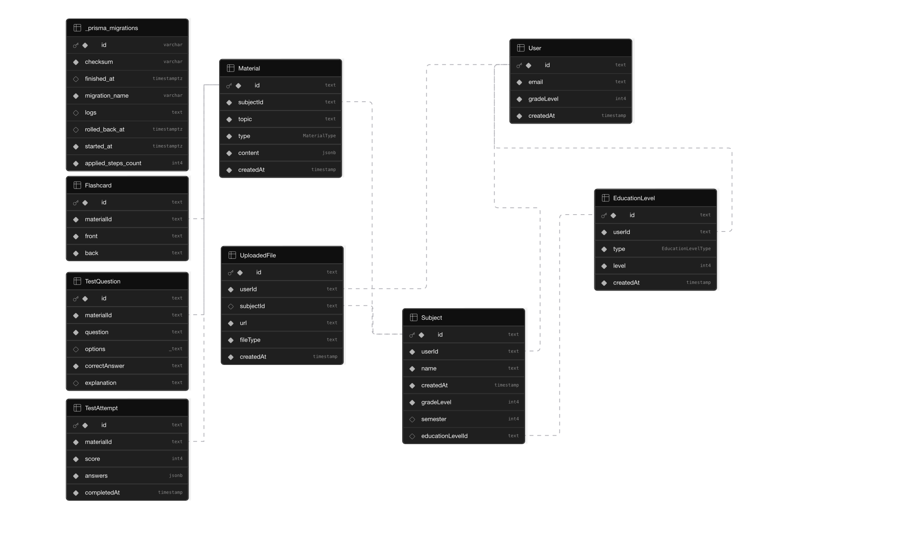

# TutorFlow – Документация

## Глава 1: Анализ и проучване

### 1.1 Предметна област и целева аудитория

TutorFlow е образователна платформа, която помага на ученици да генерират учебни материали с помощта на изкуствен интелект. Системата позволява на учениците да организират обучението си по предмети и теми, да качват собствени материали и да генерират резюмета, флашкарти и тестове.

**Предметна област:** EdTech – AI-подпомогнато самостоятелно учене

**Целева аудитория:**
- Ученици от прогимназиален и гимназиален етап (5–12 клас)
- Студенти, подготвящи се за изпити
- Всеки, който иска да учи по собствени материали с AI помощ

Системата е проектирана да бъде гъвкава – не налага фиксирана учебна програма. Учениците сами създават предмети и теми, което я прави приложима в различни образователни системи и среди.

---

### 1.2 Преглед на съществуващи решения

#### Studley AI

Studley AI е платформа за AI-генерирани учебни материали, насочена предимно към студенти. Предлага създаване на флашкарти и резюмета от качени документи.

| | |
|---|---|
| **Предимства** | Лесен интерфейс; поддържа качване на PDF |
| **Недостатъци** | Ограничена персонализация по ниво на обучение; липсва тест-генератор с автоматично оценяване; не поддържа RAG pipeline върху собствени материали |

#### Turbo AI (Study Tool)

Turbo AI предлага бързо генериране на учебни помагала от текст или документи.

| | |
|---|---|
| **Предимства** | Бързо генериране; поддържа няколко формата |
| **Недостатъци** | Генерираното съдържание не е адаптирано към класа/нивото на ученика; липсва организация по предмети и история на материалите; RAG функционалността е ограничена или липсва |

#### Сравнение с TutorFlow

За разлика от горните решения, TutorFlow:
- Адаптира съдържанието спрямо **класа на ученика**
- Поддържа пълен **RAG pipeline** – генерираното съдържание се основава директно на качените от ученика материали
- Съхранява всички генерирани материали като **дългосрочно хранилище за учене**
- Предлага **два режима на флашкарти** и **автоматично оценяване на тестове**

---

### 1.3 Аргументация на избор на технологии

| Технология | Избор | Обосновка |
|---|---|---|
| **Frontend + Backend** | Next.js (монолит) | SSR, API routes, лесен deploy, React екосистема |
| **Database** | Supabase (PostgreSQL + pgvector) | Управлявана БД, вградена поддръжка на вектори за RAG, Auth, Storage |
| **ORM** | Prisma | Type-safe заявки, TypeScript интеграция, прости миграции |
| **AI** | OpenRouter | Единна точка за всички AI заявки – генерация, OCR, embeddings |
| **Deployment** | AWS Amplify | Нативна поддръжка на Next.js, автоматичен SSL, CDN, вградено CD |
| **IaC** | Terraform | Декларативно управление на цялата AWS инфраструктура |
| **CI Pipeline** | GitHub Actions | Lint, build проверка и webhook нотификации |
| **Secrets** | AWS Amplify Env Vars + GitHub Secrets | Сигурно съхранение на API ключове и конфигурация |
| **Observability** | AWS CloudWatch | Логове и метрики от Amplify + аларми към webhook |
| **CI/CD** | GitHub Actions (CI) + Amplify (CD) | GitHub Actions проверява кода; Amplify деплойва при push към `main` |
| **Styling** | Tailwind CSS | Utility-first, бързо разработване на UI |

**Next.js** е избран като основен framework, тъй като обединява frontend и backend в един проект (монолитна архитектура), намалявайки сложността за V1. Предоставя SSR за по-добра производителност и лесна интеграция с API routes.

**Supabase** елиминира нуждата от отделна инфраструктура – предлага PostgreSQL с pgvector (за векторно търсене в RAG), Auth и Storage в единна платформа.

**OpenRouter** е избран като AI gateway, защото позволява смяна на модели без промяна на кода и покрива всички AI нужди – генерация на текст, OCR на изображения и embeddings.

**AWS Amplify** е избран за deployment защото предоставя нативна поддръжка на Next.js с вградено CDN, автоматичен SSL и CI/CD от GitHub – без нужда от управление на сървъри. Цялата инфраструктура се управлява чрез **Terraform**, което гарантира, че никаква конфигурация не се прави ръчно.

---

## Глава 2: Проектиране

### 2.1 Функционални изисквания

#### Управление на потребители
- Регистрация и вход с email и парола
- Профил с клас (grade level) за адаптиране на трудността на съдържанието

#### Управление на предмети
- Създаване, преименуване и изтриване на предмети
- Организация на всички материали по предмет

#### Генериране на учебни материали
- **Резюмета** – структурирано Markdown обяснение на тема, съобразено с класа на ученика; ако има качени файлове – съдържанието се основава на тях чрез RAG
- **Флашкарти** – двустранни карти (термин → дефиниция и обратно) генерирани от набор термини; поддържа два режима на изучаване
- **Тестове** – избираем брой въпроси (multiple choice или open-ended) с автоматично оценяване и обяснения на верните отговори

#### Качване на файлове
- Поддръжка на JPG, PNG, PDF
- Обработка чрез RAG pipeline: OCR → чункване → embeddings → съхранение в pgvector
- Генерираното съдържание под даден предмет се основава на качените от ученика материали

#### История и съхранение
- Всички генерирани материали се съхраняват и могат да бъдат преглеждани по-късно
- Метаданни: дата на създаване, тема, тип материал

---

### 2.2 Архитектура на системата

TutorFlow следва **монолитна layered архитектура**, изградена върху Next.js:

```
┌─────────────────────────────────────────┐
│           Client (Browser)              │
│         Next.js React Pages             │
└──────────────────┬──────────────────────┘
                   │ HTTP
┌──────────────────▼──────────────────────┐
│         Next.js API Routes              │
│       (app/api/* – REST endpoints)      │
└──────────┬───────────────────┬──────────┘
           │                   │
┌──────────▼──────┐   ┌────────▼─────────┐
│    Services     │   │   AI Service     │
│ (Business Logic)│   │  (OpenRouter)    │
└──────────┬──────┘   └──────────────────┘
           │
┌──────────▼──────────────────────────────┐
│              Prisma ORM                 │
└──────────┬──────────────────────────────┘
           │
┌──────────▼──────────────────────────────┐
│   Supabase (PostgreSQL + pgvector)      │
│   + Supabase Storage (файлове)          │
└─────────────────────────────────────────┘
```

**Структура на проекта:**
```
app/
  api/          # API routes (REST endpoints)
services/       # Business logic
lib/            # Споделени утилити (Prisma client, auth helpers)
prisma/         # Schema и миграции
```

**RAG Pipeline при качване на файл:**
```
Качен файл (JPG/PNG/PDF)
        │
        ▼
  OCR (vision модел via OpenRouter)
        │
        ▼
  Чункване на текст
        │
        ▼
  Embeddings (via OpenRouter)
        │
        ▼
  Съхранение в pgvector (Supabase)
        │
        ▼
  При генерация → similarity search → инжектиране в prompt
```

---

### 2.3 Инфраструктурна диаграма

```
┌─────────────────────────────────────────────────────────────────┐
│                        Developer                                │
│                    git push → main                              │
└──────────────┬──────────────────────────────────────────────────┘
               │
               ▼
┌──────────────────────────────┐
│       GitHub Actions (CI)    │
│  - lint                      │
│  - next build check          │
│  - webhook notify on fail    │
└──────────────┬───────────────┘
               │ push triggers
               ▼
┌──────────────────────────────────────────────────────────────┐
│                        AWS                                   │
│                                                              │
│  ┌─────────────────────────────────────────────────────┐     │
│  │               AWS Amplify (CD)                      │     │
│  │  - build Next.js app                                │     │
│  │  - deploy to CDN edge locations                     │     │
│  │  - auto SSL / custom domain                         │     │
│  │  - env vars from Amplify Environment                │     │
│  └──────────────────────┬──────────────────────────────┘     │
│                         │                                    │
│  ┌──────────────────────▼──────────────────────────────┐     │
│  │             AWS CloudWatch                          │     │
│  │  - access logs + build logs from Amplify            │     │
│  │  - metrics (error rate, latency)                    │     │
│  │  - Alarms → SNS → webhook notifications             │     │
│  └─────────────────────────────────────────────────────┘     │
│                                                              │
│  ┌─────────────────────────────────────────────────────┐     │
│  │         Terraform (IaC)                             │     │
│  │  manages: Amplify app, branch config,               │     │
│  │  env vars, CloudWatch alarms, SNS topics            │     │
│  └─────────────────────────────────────────────────────┘     │
└──────────────────────────────────────────────────────────────┘
               │
               ▼
┌──────────────────────────────────────────────────────────────┐
│                    Supabase (External)                       │
│         PostgreSQL + pgvector + Auth + Storage               │
└──────────────────────────────────────────────────────────────┘
               │
               ▼
┌──────────────────────────────────────────────────────────────┐
│                    OpenRouter (External)                     │
│            AI generation, OCR, embeddings                    │
└──────────────────────────────────────────────────────────────┘
```

**Компоненти управлявани от Terraform:**
- `aws_amplify_app` – свързва GitHub репото с Amplify
- `aws_amplify_branch` – конфигурация на `main` клона (auto-build)
- `aws_amplify_environment_variable` – env vars (Supabase, OpenRouter ключове)
- `aws_cloudwatch_metric_alarm` – аларми при грешки или висока латентност
- `aws_sns_topic` + `aws_sns_topic_subscription` – webhook нотификации

**Secrets Management:**
- Чувствителни стойности (API ключове) се съхраняват в GitHub Secrets за CI и в Amplify Environment Variables за runtime
- Никакви тайни не се commit-ват в кода – Husky pre-commit hook блокира подобни опити

---

### 2.4 Схема на базата данни



---

### 2.5 UML диаграми

#### Data Model (Entity Relationship Diagram)


Диаграмата показва основните обекти в системата и техните релации:

**Основни обекти:**

| Обект | Полета |
|---|---|
| **User** | id (PK), email, gradeLevel, passwordHash, createdAt |
| **Subject** | id (PK), userId (FK), name, createdAt |
| **Material** | id (PK), subjectId (FK), topic, type (MaterialType), content (JSON), createdAt |
| **Flashcard** | id (PK), materialId (FK), front, back |
| **TestQuestion** | id (PK), materialId (FK), question, options, correctAnswer, explanation? |
| **TestAttempt** | id (PK), materialId (FK), score, answers (JSON), completedAt |
| **UploadedFile** | id (PK), userId (FK), subjectId? (FK), url, fileType, createdAt |

**Enum MaterialType:** `SUMMARY | FLASHCARD | TEST`

**Релации:**
- `User` → `Subject` (1:N)
- `Subject` → `Material` (1:N)
- `Material` → `Flashcard` (1:N)
- `Material` → `TestQuestion` (1:N)
- `Material` → `TestAttempt` (1:N)
- `User` → `UploadedFile` (1:N)
- `Subject` → `UploadedFile` (1:N, optional)

---

### 2.6 UI Дизайн

**Dashboard – управление на предмети**


